## 📚 Table of Contents

- [About the Project](#-about-the-project)
- [Client Overview](#-client-overview)
  - [ECG Analysis](#-ecg-analysis)
  - [EEG Analysis](#-eeg-analysis)
  - [Audio Sampling (Gender Recognition)](#-audio-sampling-gender-recognition)
  - [Doppler Sound Generation](#-doppler-sound-generation)
  - [Drone Classification](#-drone-classification)
  - [SAR Analysis](#-sar-analysis)
- [Server Overview](#-server-overview)
- [AI Models](#-ai-models)
- [Installation & Setup](#-installation--setup)

---

## 🧩 About the Project

The **Signal Intelligence Web Platform** is a comprehensive environment for **interactive signal analysis**, **AI-powered diagnostics**, and **scientific visualization** across multiple signal domains.

It combines advanced processing and modeling capabilities for:

- 🫀 **Biomedical Signal Processing:** Real-time analysis and visualization of ECG and EEG signals  
- 🎵 **Audio Signal Analysis:** Interactive sampling with frequency controls, gender classification, and anti-aliasing filters  
- ⚙️ **Physics-Based Simulation:** Interactive Doppler effect simulation and synthetic sound generation  
- 🚁 **Drone Classification:** Identification and classification of drone types using AI-driven acoustic and signal features  
- 🛰️ **Synthetic Aperture Radar (SAR) Image Analysis:** SAR-based image creation and interpretation for remote sensing  
- 🤖 **Deep Learning Integration:** Embedded AI models for prediction, classification, and anomaly detection  
- 📈 **Real-Time Visualization:** Multi-channel signal plotting, recurrence analysis, and polar representations  

> 🗒️ **Note:**  
> The project is organized into two main components:
>
> - `client/` — Frontend for visualization and interaction  
> - `server/` — Backend for signal processing, AI inference, and data handling  
>
> Sensitive and large AI model files are excluded from version control using `.gitignore` for privacy and storage optimization.

---

## 💻 Client Overview

The **client** provides an intuitive interface for visualizing, analyzing, and exploring **multi-channel signals**.  
It includes major analysis modules for ECG, EEG, Audio Sampling, Doppler, Drone, and SAR signals.


---

### 🫀 ECG Analysis

**Expected JSON Input Attributes:**
- `signals`: 2D array _(shape: n_samples × n_channels)_
- `leads`: Array of lead names
- `samplingRate`: Sampling rate of the readings

**Features**

| **Feature**                                 | **Description**                                                                                                                                                                                                                                      | **Preview**                                      |
|---------------------------------------------|------------------------------------------------------------------------------------------------------------------------------------------------------------------------------------------------------------------------------------------------------|--------------------------------------------------|
| **Multi-Channel Linear Plotting**           | Enables synchronized visualization of ECG signals across multiple leads in the **time domain**, allowing detailed analysis of waveform amplitude, duration, and rhythm consistency across channels.                                                   | 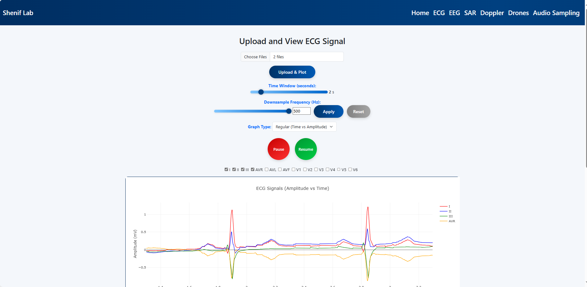 |
| **Multi-Channel Polar Plotting**            | Visualizes ECG signals in a **polar (phase-space)** representation, highlighting phase relationships, waveform morphology, and inter-lead synchronization patterns.                                            | 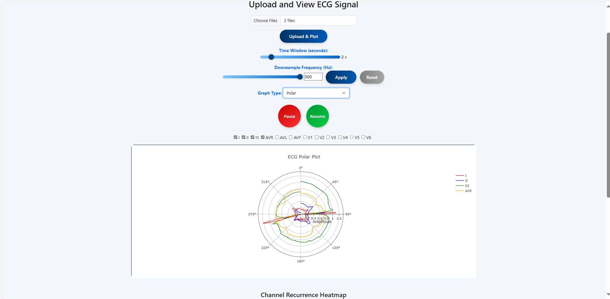   |
| **Recurrence Plot (Two-Channel Analysis)**  | Computes and visualizes **recurrence relationships** between two ECG leads, aiding in the detection of nonlinear patterns, rhythmic structures, and cross-channel dependencies.                               | 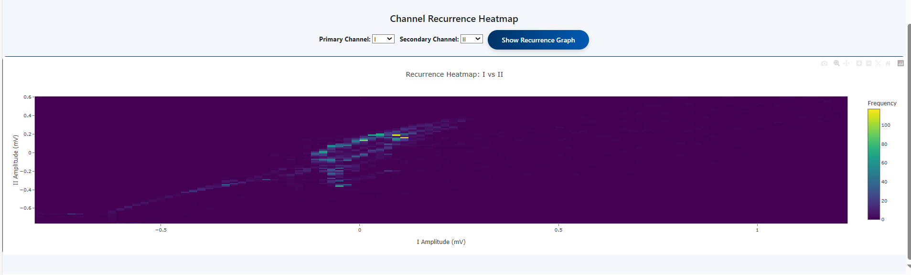     |
| **Downsampling**                            | Reduces ECG sampling rate to enhance processing speed and simplify visualization without losing essential waveform features.                                            | 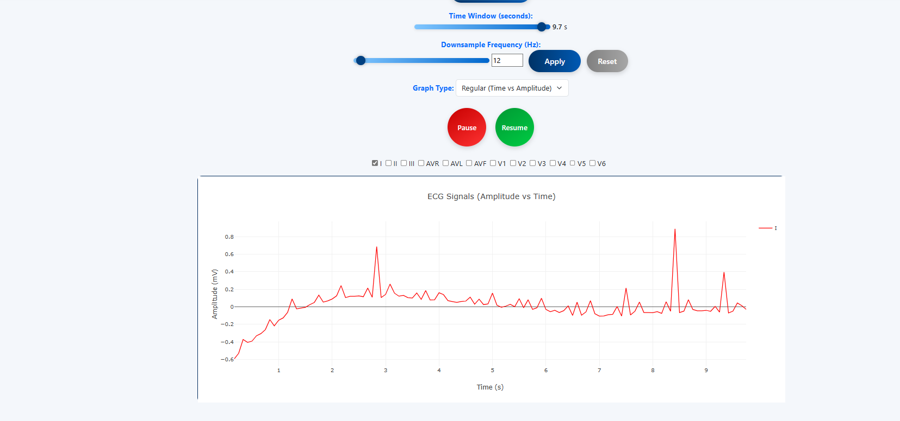  |


---

### 🧠 EEG Analysis

**Expected EDF Input Attributes:**
- `signals`: 2D signal matrix _(shape: n_samples × n_channels)_

**Features**
| **Feature**                   | **Description**                                                                                     | **Image**                                         |
| ------------------------------ | --------------------------------------------------------------------------------------------------- | ------------------------------------------------- |
| **Multi-channel Linear Plotting** | Simultaneous EEG waveform visualization across multiple channels in the **time domain**, enabling detailed observation of amplitude, phase, and synchronization. | 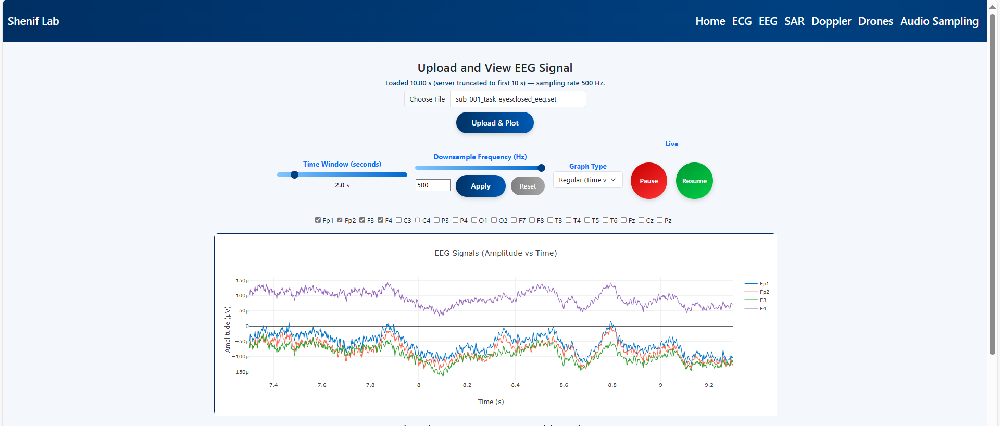 |
| **Multi-channel Polar Plotting**  | Displays EEG signals in a **polar (phase-space)** view, revealing cyclic or phase-locked dynamics between channels. | 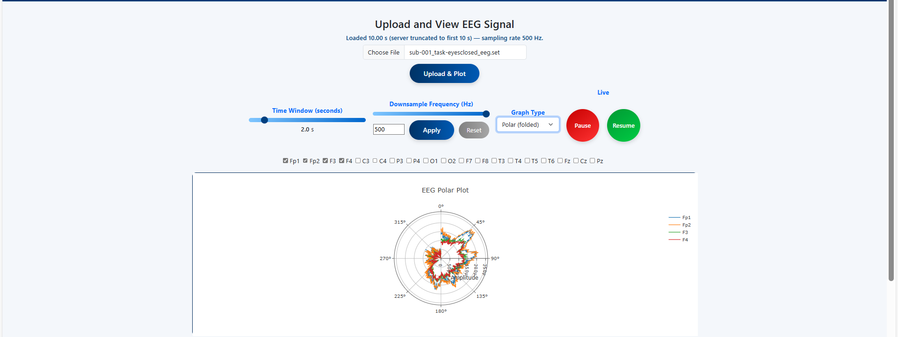   |
| **Recurrence Plot (2 Ch)**       | Analyzes **dynamic recurrence relationships** between two EEG channels, aiding in the detection of periodic or chaotic structures. | 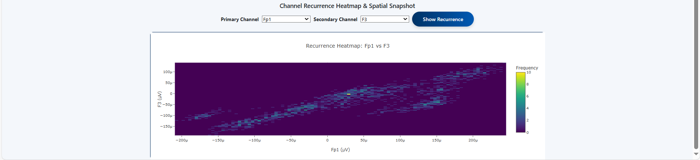 |
| **Downsampling**                 | Reduces EEG signal resolution to focus on main frequency bands and smooth noisy data.              | 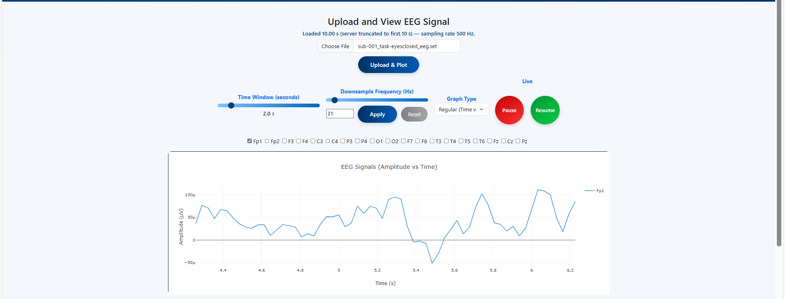  |


---

### 🎙️ Audio Sampling (Gender Recognition)

**Expected Input:**
- `.wav` or `.mp3` audio file (speech sample)

**Features**

| **Feature** | **Description** | **Image** |
| ------------ | ---------------- | ---------- |
| **Audio Signal Visualization (Before Anti-Aliasing)** | Displays the raw waveform sampled from the input voice signal. |   |
| **Gender Classification (AI Model)** | Identifies gender (Male/Female) using trained neural network models. | 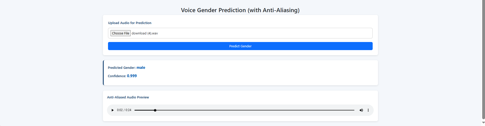 |
| **Audio Signal Visualization (After Anti-Aliasing)** | Shows the cleaned and filtered version of the signal after anti-aliasing. |  |


---

### 🔊 Doppler Sound Generation

**Parameters:**
- Frequency of source  
- Velocity of source  
- Duration

**Features**

| **Feature**                                | **Description**                                                                                            | **Image**                                                          |
| ------------------------------------------ | ---------------------------------------------------------------------------------------------------------- | ------------------------------------------------------------------ |
| **Amplitude & Frequency vs Time Plot**     | Visualize the simulated Doppler signal                                                                     | 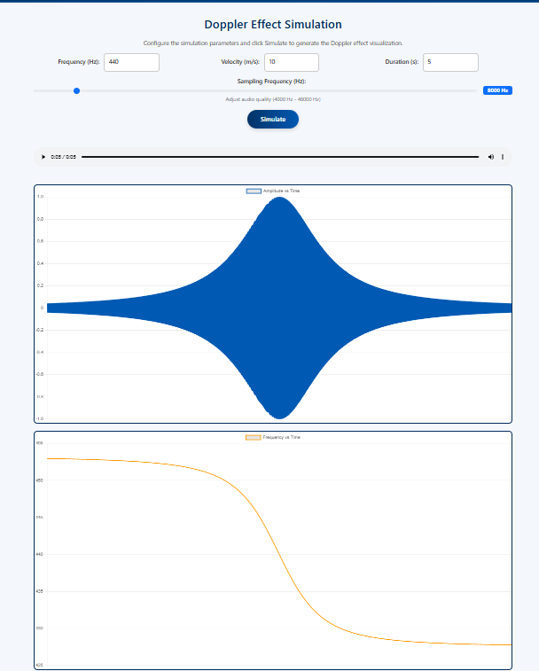     |

---

### 🚁 Drone Classification

**Expected Input:**
- Audio or signal sample from drone source

**Features**

| **Feature**               | **Description**                                                                     | **Image**                                          |
| -------------------------- | ----------------------------------------------------------------------------------- | -------------------------------------------------- |
| **AI-Based Classification** | Identifies drone type using pre-trained models hosted on Hugging Face or locally | 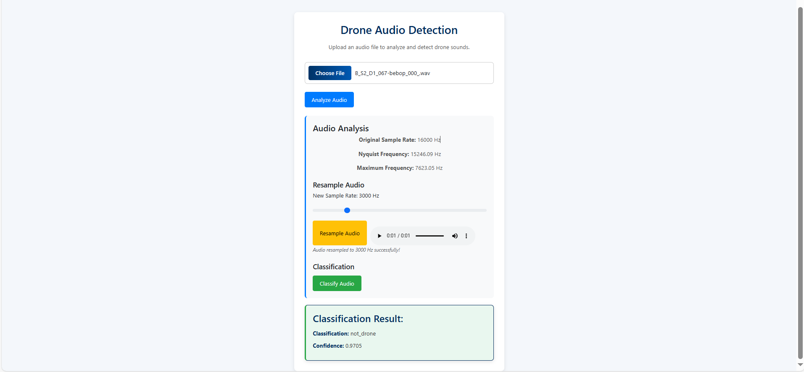 |


---

### 🛰️ SAR Analysis

**Expected Input:**
- SAR raw signal or pre-processed SAR image

**Features**

| **Feature**                 | **Description**                                                                                   | **Image**                                     |
| ---------------------------- | ----------------------------------------------------------------------------------------------- | --------------------------------------------- |
| **SAR Image Formation**      | Generates SAR images from raw radar echoes using range-Doppler or back-projection algorithms.   | 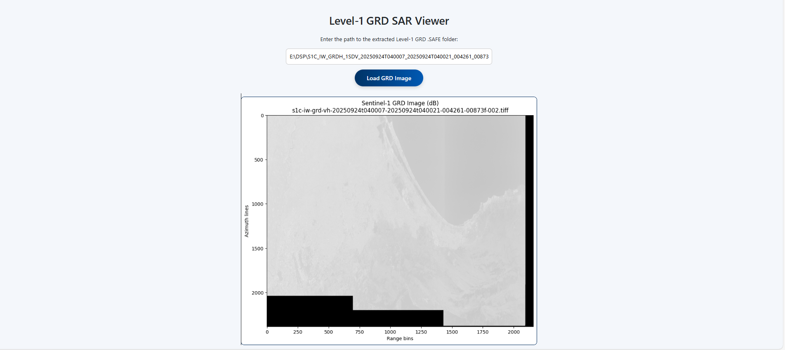 |


---

## ⚙️ Server Overview

The **server** manages:

- Signal processing requests (ECG, EEG, Audio, Doppler, Drone, SAR)
- AI inference endpoints
- File handling and normalization

> 🧾 **Notes:**  
> The server handles JSON uploads, 2D signal arrays, and integrates with local AI models (ignored in Git).


---

## 🧠 AI Models

| **Model**            | **Task**                                  | **Location / Source**                                                        | **Note**           |
| -------------------- | ----------------------------------------- | ---------------------------------------------------------------------------- | ------------------ |
| **ECG Model**        | Cardiac abnormality detection             | `server/models/ecg_model.h5`                                                 | Ignored in Git     |
| **EEG Model**        | EEG signal pattern detection              | `server/models/eeg_model.h5`                                                 | Ignored in Git     |
| **Gender Model**     | Voice-based gender recognition            | `server/models/gender_model.h5`                                              | Ignored in Git     |
| **Doppler Model**    | Frequency & velocity prediction           | `server/models/doppler_model.h5`                                             | Ignored in Git     |
| **Drone Classifier** | Drone type recognition and classification | [Hugging Face Model Repository](https://huggingface.co/) _(Hosted remotely)_ | Not stored locally |


---

## ⚙️ Installation & Setup

```bash
# 1. Clone the repository
git clone https://github.com/Khalaf649/SignalVistaHub-MVC.git
cd SignalVistaHub

# 2. Install client dependencies
cd client
npm install
npm run dev

# 3. Install server dependencies
cd ../server
pip install -r requirements.txt

# 4. Run the server
uvicorn main:app --reload
